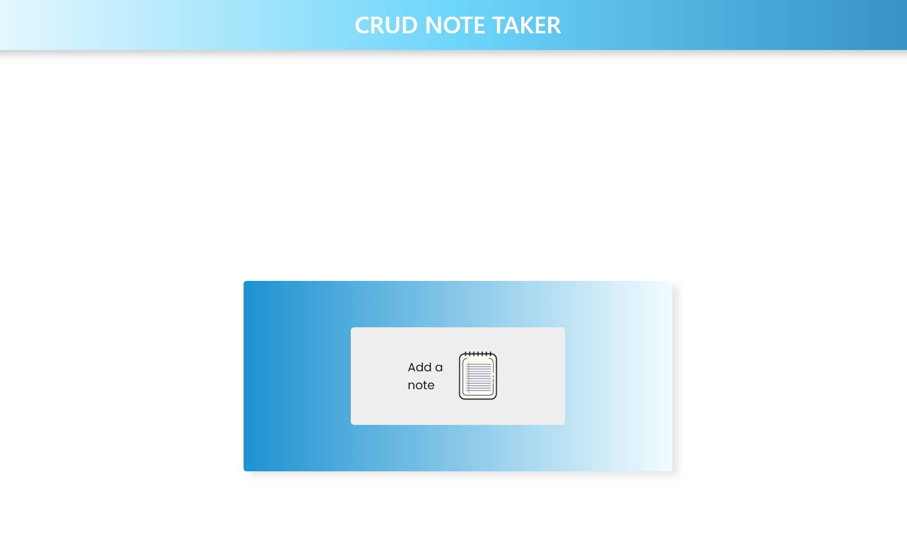

# CRUD_Note_Taker

## Description
```
CRUD Note Taker is an app that will let you create, read, update, 
and delete a note. Used React.js, CSS3, and Bootstrap for the client side
and for the back end I used Mysql, and Express.
```

## Table of Contents
* [Description](#description)
* [Installation](#installation)
* [Usage](#usage)
* [Credits](#credits)
* [License](#license)
* [Contributing](#Contributing)
* [Test](#Test)


## Installation
```
well need to npm i to install mysql, express, dotenv,
and body-parser for the server side. Once you have all 
dependencies run "npm run dev" to run application on
your local computer
```


## Usage




## Credits
```
ANTHONY GUERRERO
```

## License
[](#license)

## Contributing
```
N/A
```

 ## Tests
 ```
 npm run test
 ```
 ## Questions

 

 If you have any questions about the project, repo, or any issue you can contact me at [Anthony Guerrero](https://github.com/knuckleh3ad89) directly.